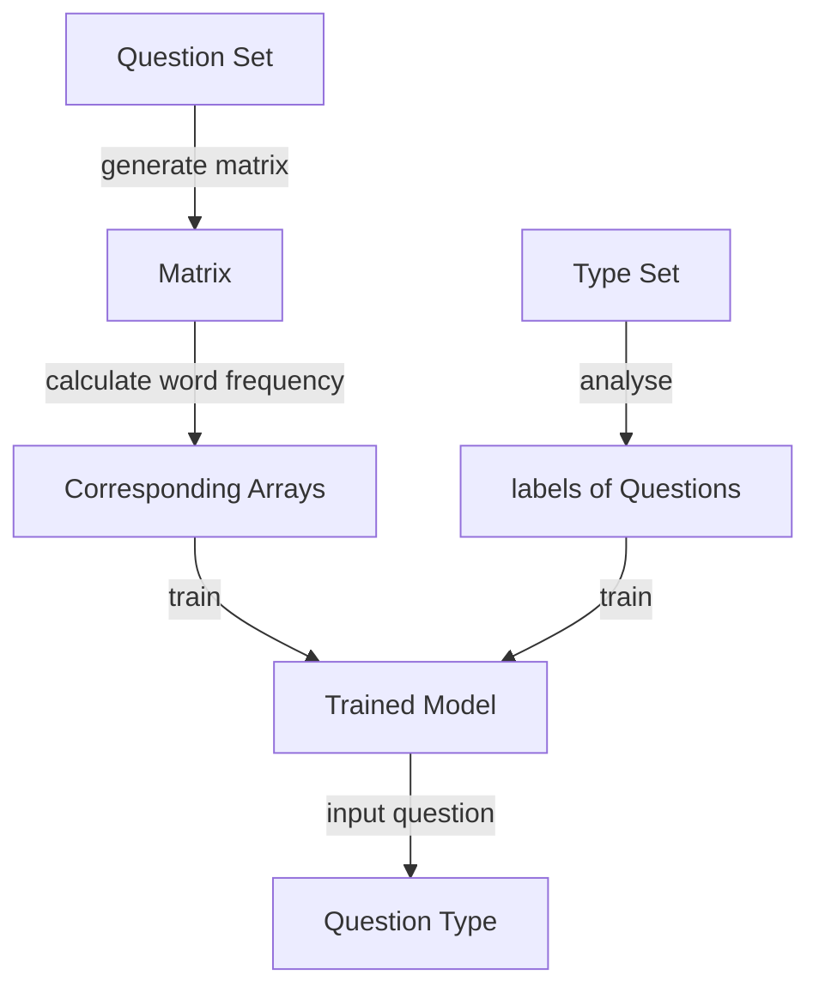

# text_classifier

## Features

- A question classifier, training using the dataset with 636 questions in 10 types, testing using 52 different questions

- user-input supported

- using **K-Nearest Neighbor Algorithm** and **MLP Neural Network**

## Method

- Store the question set in one text file, the corresponding **type of each question** in another text file

- Suppose there are **_n_** different words in the question set, we create a __1 * n matrix__, each word corresponds to one element in the array, in the sequence of appearance.

- Calculate the **word frequency** of __each question__, if any word has a frequency **greater than zero**, set the corresponding element in the array to **one**, then set other elements to **zero**.

- Suppose there are **_m_** questions in the question set, then we got **_m_** arrays with length **_n_**, each corresponds to one question.

- Read another text file and get the **labels of each question**. Pair the labels with **questions’ corresponding array**.

- Train the model with **(array_1, label_1) to (array_n, label_n)**

- Get user-input question, convert it to a __1*n matrix__ as before, use the model to **predict** its corresponding label, which gives its type

## Screenshot

# Background

## FoSE Innovation Lab - Middle Part Report

### Part1: Brief Introduction

The project is "Faculty Reception Enquiry Support Heuristics", and our group play the role as a bridge between front end and back end. By applying K-Nearest Neighbour Algorithm and MLP Neural Network, we build a "Question classifier". We could pass the question(text version) from the front end to this classifier, and it would output the class of the question. To train the classifier we used a dataset with 636 questions in 10 types, and it finally reached the accuracy of 94.8%.

### Part 2: How it works?

We store the question set in one text file, the corresponding type of each question in another text file.

Suppose there are n different words in the question set, we create a 1 \* n matrix, each word corresponds to one element in the array, in the sequence of appearance. Then, we calculate the word frequency of each question, if any word has a frequency greater than zero, set the corresponding element in the array to one, then set other elements to zero. Suppose there are m questions in the question set, then we got m arrays with length n, each corresponds to one question.

The program will read another text file and get the labels of each question. We pair the labels with questions’ corresponding array and train the model with (array_1, label_1) to (array_n, label_n)

Get user-input question, convert it to a 1\*n matrix as before, use the model to predict its corresponding label, which gives its type.

### Part 3: Where data comes from?

The question is mainly from Faculty Office's Moodle page[(https://moodle.nottingham.ac.uk/course/view.php?id=20556)](https://moodle.nottingham.ac.uk/course/view.php?id=20556)

Here listed a few web pages we referred:

- https://moodle.nottingham.ac.uk/mod/resource/view.php?id=4088458
- https://moodle.nottingham.ac.uk/mod/resource/view.php?id=4622514
- https://moodle.nottingham.ac.uk/mod/folder/view.php?id=2896873
- https://www.nottingham.ac.uk/qualitymanual/quality-manual.aspx
- ....

Vreni offered a large sum of questions, and updated our question dataset as well.

### Part 4: How is its Performance?

- Accuracy (MLP Neural Network): 94.3%
- Accuracy (KNN Algorithm): 94.8%

Obtained by **Leave-One-Out-Cross-Validation (LOOCV)**

This program use _both_ above methods.

### Part 5: How to use it?

- install _Python 3.x_
- install _Python package_ __Numpy, matplotlib__ and __Scipy__
- install _Python package_ __sklearn__
- download __hamlet_all.txt__ and __labels_all.txt__
- open __NLPC_CV.py__

